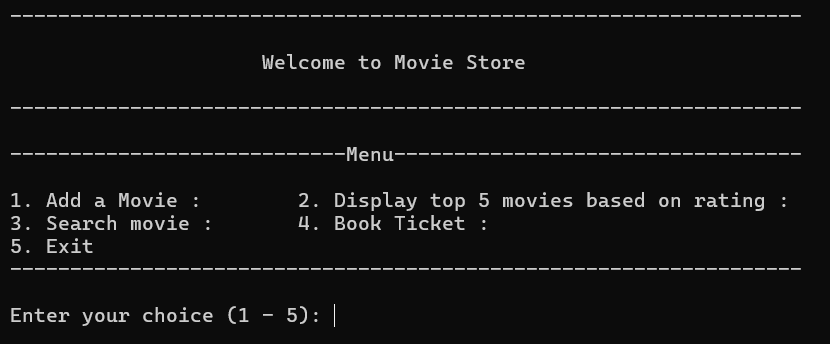
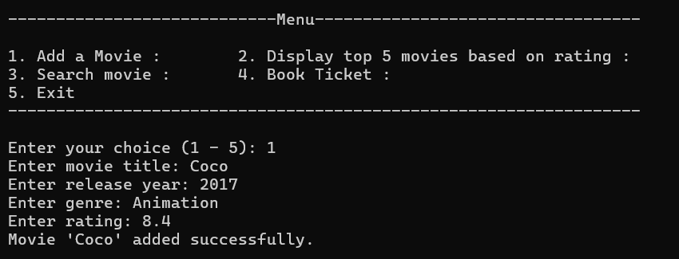
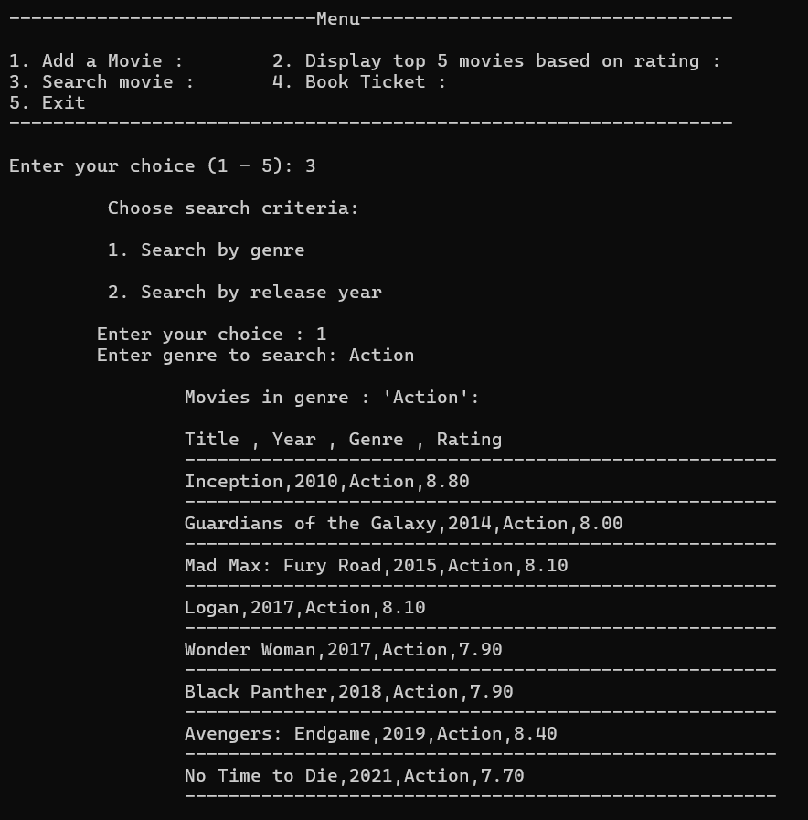
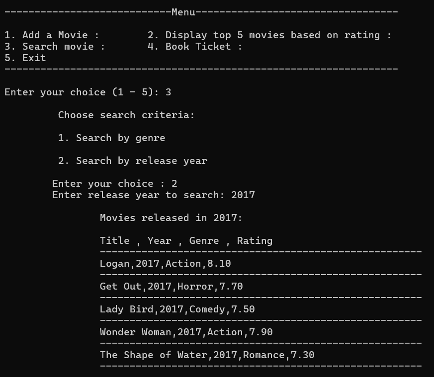
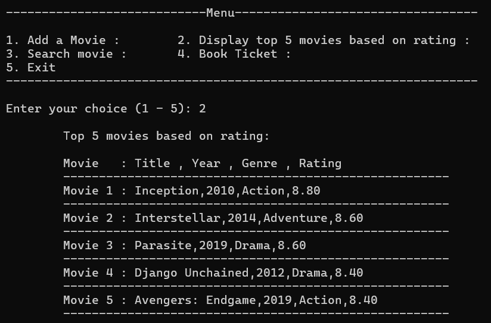
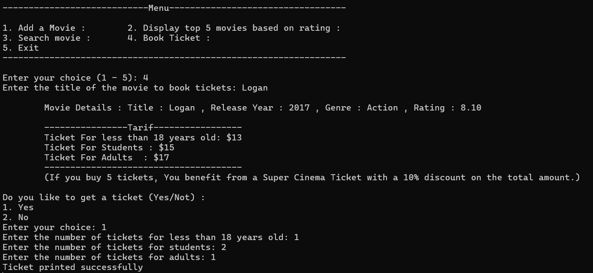
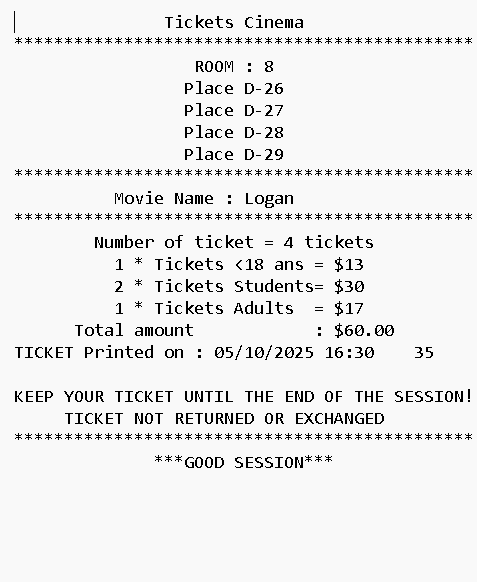

# 🎬 Cinema Management System

A **terminal-based desktop application** written in **C language** that allows cinema administrators to manage movies, handle ticket bookings, and display film information efficiently.

This project demonstrates **file handling**, **menu-driven programming**, and **data organization** in C — ideal for beginners and students in programming courses.

---

## 🖥️ Preview

### 🏠 Home Menu

[](./screenshots/home.png)

### 🎥 Add Movie

[](./screenshots/add_movie.png)
### 🔍 Search by Genre

[](./screenshots/search_by_genre.png)

### 🔎 Search by Year

[](./screenshots/search_by_year.png)

### ⭐ Display Top 5 Movies

[](./screenshots/display_top_5.png)

### 🎫 Ticket Booking

[](./screenshots/booking.png)

[](./screenshots/Ticket.png)

---

## 💡 Project Overview

The **Cinema Management System** allows you to:

* Add new movies with details like **title**, **genre**, **year**, and **rating**
* Search for movies by **genre** or **release year**
* Display a list of **top-rated movies**
* **Book tickets** for specific movies
* Store all movie data in a text file called **[Movie.txt](https://github.com/Abd-Rahim1/cinema-management-system/blob/main/Movie.txt)**, which you can open in Excel or Power BI for analysis

---

## 🛠️ Technologies Used

* **C Programming Language**
* **File Handling**
* **Text File (TXT) for Data Storage**
* **Menu-Driven Programming**

---

## ⚙️ Installation & Setup

### Step 1 — Clone the repository

```bash
git clone https://github.com/Abd-Rahim1/cinema-management-system.git
```

### Step 2 — Navigate to the project folder

```bash
cd cinema-management-system
```

### Step 3 — Compile the program

```bash
gcc Project.c -o Project
```

### Step 4 — Run the program

```bash
./Project.exe
```

---

## 📂 Project Structure

```
cinema-management-system/
├── Project.c            # Main source code
├── Movie.txt            # Movie dataset
├── README.md            # Project documentation
└── screenshots/         # Application screenshots
    ├── home.png
    ├── add_movie.png
    ├── search_by_genre.png
    ├── search_by_year.png
    ├── display_top_5.png
    ├── booking.png
    └── Ticket.png
```

---

## 📈 Future Improvements

* Add **admin login system**
* Implement **movie rating update** feature
* Create a **graphical interface** using C & GTK
* Add **JSON export** for modern data tools

---

## 👨‍💻 Author

**Abd Rahim Mojbani**
🎓 Software Engineering & Information Systems Student
📧 [a.mojbani@pristini-international.tn](mailto:a.mojbani@pristini-international.tn)
🌐 [GitHub Profile](https://github.com/Abd-Rahim1)

---
